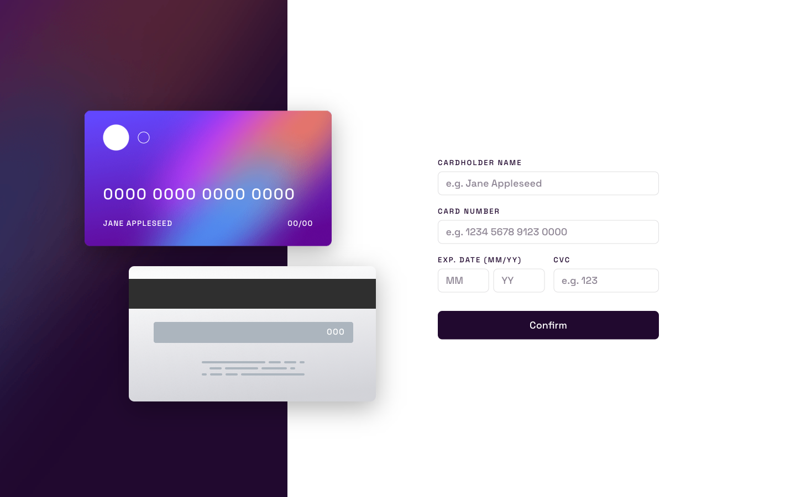
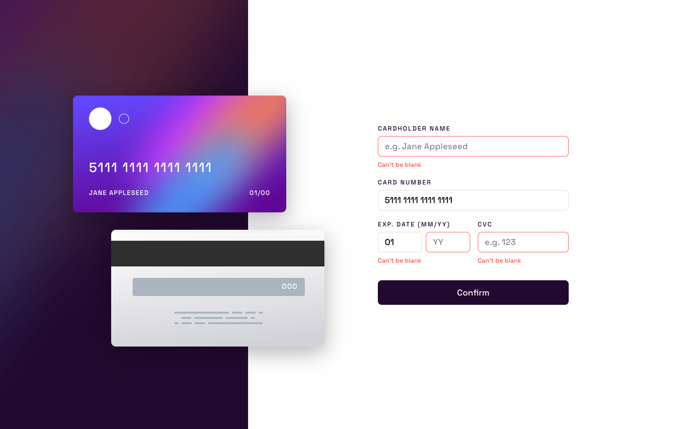
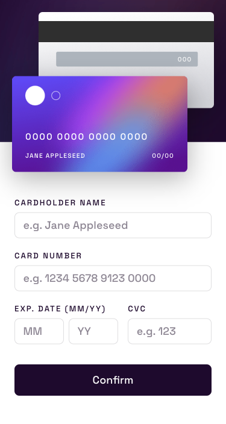

# Frontend Mentor - Interactive card details form solution

This is Max Ruuen's solution to the [Interactive card details form challenge on Frontend Mentor](https://www.frontendmentor.io/challenges/interactive-card-details-form-XpS8cKZDWw).

## Table of contents

- [Overview](#overview)
  - [The challenge](#the-challenge)
  - [Screenshot](#screenshot)
  - [Links](#links)
- [My process](#my-process)
  - [Built with](#built-with)
  - [What I learned](#what-i-learned)
    - [Input masking](#input-masking)
    - [Credit card type matching](#credit-card-type-matching)
    - [Card illustration accessibility requirements](#card-illustration-accessibility-requirements)
  - [Continued development](#continued-development)
  - [Useful resources](#useful-resources)
- [Author](#author)
- [Acknowledgments](#acknowledgments)

## Overview

### The challenge

Users should be able to:

- Fill in the form and see the card details update in real-time
- Receive error messages when the form is submitted if:
  - Any input field is empty
  - The card number, expiry date, or CVC fields are in the wrong format
- View the optimal layout depending on their device's screen size
- See hover, active, and focus states for interactive elements on the page

### Screenshot

#### Desktop

#### Mobile

### Links

- Solution URL: [Frontend Mentor](https://www.frontendmentor.io/solutions/interactive-card-details-form-with-react-and-scss-AHh83Z-3f_)
- Live Site URL: [Netlify](https://mbr-challenge-interactive-card-details.pages.dev/)

## My process

### Built with

- React
- SCSS
- [IMaskJS](https://imask.js.org/) (for input masking)
- [credit-card-type](https://github.com/braintree/credit-card-type) (for card number format validation)

### What I learned

This was a surprisingly fun challenge which I broke up into many smaller bits which eventually formed the solution. I liked this approach as it let me focus & research new topics in more detail than if I was "stressed" while stuck in the middle of a solution trying to progress.

I broke the challenge down into the below bits & utilised CodeSandbox to make small demos/components, and share these when I needed feedback from other devs:

- Masking the credit card number field
- Credit card illustration accessibility structure
- Credit card illustration styling
- Final app assembly

My general learnings other than the main points of this challenge were:

- Reducers in React are awesome and I'm finding them really useful
- I need to continue learning and practicing the other available hooks in React + making custom hooks
- I think it's time to start learning form plugins for React - I've built a lot of forms by hand at this point
- Spent much more time getting comfortable with flex grow and font-size clamp() behavior when styling this challenge. This solution feels more responsive with less CSS than my other solutions.

#### Input masking

I found input masking is a huge challenge if you're trying to implement this yourself, and it's more advised to reach for a library if this is needed. Masking majority of input fields seems pretty easy, but trying to mask inputs with a wild range of possible formats and unknowns (like credit card numbers) is a different beast entirely.

If I had my choice, I would not implement credit card number masking after my experience here, but I treat these challenges in a way that all design elements are final and non-negotiable.

So if asked to implement this masking at gunpoint, I think the key for success is using a proven library to handle credit card type matching, then using a masking library to handle the input behaviour while ensuring that your fallback **never prevents the user from entering their card information at any stage**.

#### Credit card type matching

You could attempt to use [lists of known card IIN patterns](https://baymard.com/checkout-usability/credit-card-patterns) to match card issuers and apply logic to handle their spacing patterns, but this is kind of impossible to achieve 100% coverage across every card in existence. All IIN matches and spacing patterns don't appear to be known, and unless you had mountains of money I'd imagine this info will stay that way.

The JS library `credit-card-type` seems like the best option to get matches that cover the large majority of cases - this library is awesome and I hope it continues to be maintained.

#### Card illustration accessibility requirements

When scoping this challenge, I was unsure if the card illustration should be hidden from a screenreader entirely due to the information already being available and read in the form as the user is navigating.

I received feedback on this from the Frontend Mentor Discord channel which advised that a better approach would be to describe the block of illustrations as "An illustration of the front and back of a payment card" and hide the text elements.

You could also optionally include something like "The card details displayed on the card will dynamically update when the adjacent card details fields are completed." in the description, but it was deemed not fully necessary.

The justification for this recommendation would be that the graphic is mostly decorative, and its dynamic text content duplicates the contents of the adjacent input fields, but we can’t know for sure that some AT users (who are affected by aria-hidden) might benefit from knowing that it is there.

The text inside can be hidden as the image description covers all that is needed when considering that the text content is duplicated by the form.

### Continued development

I plan to revisit this in future to implement a form plugin for React & make the input components a bit more reusable once I've done more learning on this.

### Useful resources

- Baymard Institute [article](https://baymard.com/blog/credit-card-field-auto-format-spaces) on credit card number field masking
- [IMaskJS](https://imask.js.org/) library & docs for input masking in JS & React
- Honorable mention to [Maskito](https://github.com/taiga-family/maskito) library for masking as well. This one was good but didn't quite meet the need for mask behavior to change dynamically.

## Author

- Frontend Mentor - [@ruuen](https://www.frontendmentor.io/profile/ruuen)
- Twitter - [@maxruuen](https://www.twitter.com/maxruuen)

## Acknowledgments

Greatly appreciate the dev mentors from the Frontend Mentor Discord channel for their feedback and information: @Grace-Snow, @alexkmarshall, @jamesfromslack
